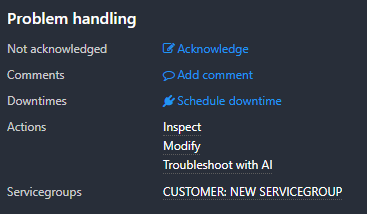
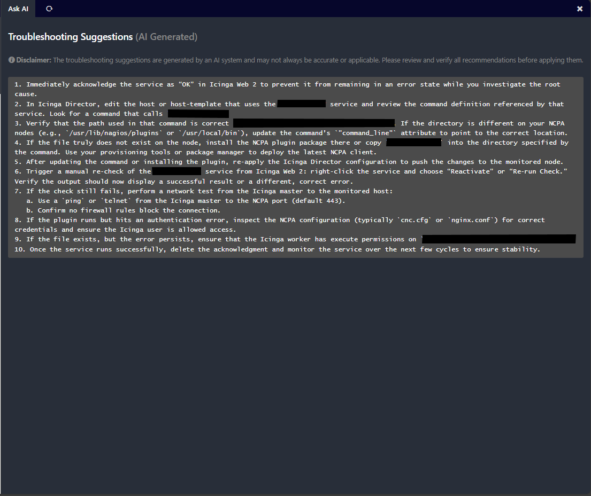
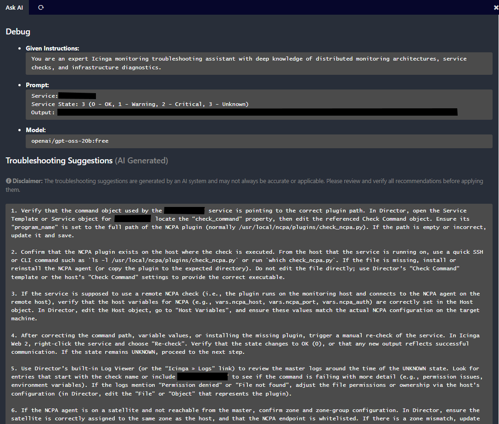

# Icinga Web 2 AskAI Module

## About

The AskAI module for Icinga Web 2 provides AI-powered assistance and insights for your monitoring environment.

## Requirements

* Icinga Web 2 (>= 2.9)
* PHP (>= 7.2)

## Installation

### Module Installation

Extract this module to your Icinga Web 2 modules directory as `askai`:

```bash
cd /usr/share/icingaweb2/modules
git clone https://github.com/samuelhliva/icingaweb2-module-askai.git askai
```

### Enable the Module

Enable the module in Icinga Web 2:

```bash
icingacli module enable askai
```

Or via the web interface: `Configuration` → `Modules` → `askai` → `Enable`

## Usage

Once set up, the AskAI module will add a Host/Service action to hosts that are in non-OK status `Troubleshoot with AI`.
A new column will load and open when the response is fetched from the remote API server.



### Debug

With the Debug option turned on, the output is extended by a separate section. It provides `Given Instructions`, `Prompt` and `Model` configuration together with the response.



## Disclaimer

The content generated by an AI is not a responsibility of this module and its author. The AskAI module only provides the solution to connect your AI agent with the Icingaweb2 interface. Thus, the troubleshooting suggestions are only as good as you instruct and teach the agent to be.

## License

This program is free software: you can redistribute it and/or modify
it under the terms of the GNU General Public License as published by
the Free Software Foundation, either version 2 of the License, or
(at your option) any later version.

This program is distributed in the hope that it will be useful,
but WITHOUT ANY WARRANTY; without even the implied warranty of
MERCHANTABILITY or FITNESS FOR A PARTICULAR PURPOSE. See the
GNU General Public License for more details.

You should have received a copy of the GNU General Public License
along with this program. If not, see <https://www.gnu.org/licenses/>.

Copyright (C) 2025 Samuel Hliva
